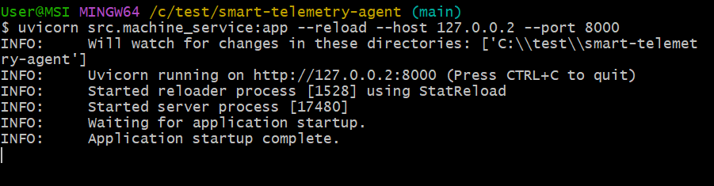

# Smart Telemetry and Diagnostics System


A privacy-aware, machine-learning-powered edge diagnostics framework that monitors system telemetry and automatically responds to anomalies using human-readable rules and cloud-based advice.
---
## 🛰️ Project Overview

The **Smart Telemetry and Diagnostics System** is an intelligent, privacy-aware framework designed to proactively monitor and respond to hardware conditions in edge environments. It uses real-time telemetry data—such as temperature, CPU usage, and power consumption—to detect abnormal behavior and trigger appropriate actions either locally or through cloud escalation.

At its core, the system combines a lightweight edge agent, a rule-based decision engine, and a machine learning model trained to classify severity levels (Normal, Warning, Critical) based on telemetry trends. This setup enables real-time, explainable, and auditable decision-making on resource-constrained devices, with configurable privacy controls and cloud integration for deeper analysis when needed.

Key use cases include:
- Predictive diagnostics for IoT or industrial edge devices
- Autonomous response to system overheating or stress
- Rule- and ML-driven device protection with minimal human intervention

---

## 🔧 Features

- **Edge-based Telemetry Collection** via secure FastAPI
- **Random Forest Classifier** trained on temperature-driven telemetry data
- **Rule-based Diagnostic Engine** with JSON-defined conditions
- **Cloud Escalation** for critical issues and remote advice using LLM
- **Configurable Privacy Modes**:
  - `disable_telemetry` – disables all processing
  - `local_only` – runs locally without cloud access
  - `share_with_dell` – enables full cloud and edge interaction
- **Mocked Dataset Generation** using Hugging Face for simulation

---

## 📁 Project Structure
```text
├── cloud/                                      # Folder containing cloud related files
│   ├── cloud_rules.json                        # Rule set for cloud-side escalations
│   ├── edge_rules.json                         # Rule set for edge-side 
│   ├── log_err.json                            # Output for unmatched rules in cloud processing
│   ├── random_forest_model.joblib              # Trained model stored for cloud use
│
├── edge/                                       # Folder containing cloud related files
│   ├── edge_rules.json                         # Rule set for local edge-level responses. Copied from cloud.
│   ├── random_forest_model.joblib              # Trained model for edge inference. Copied from cloud.
│
├── doc/                                        # Documentation or design diagrams
│   ├── Architecture_diagram.drawio             # Editable architecture diagram (source file)
│   ├── Architecture_diagram.png                # Exported image version for slides/docs
│   ├── Architecture.docx                       # Supporting architecture document
│   ├── Intelligent_Assistant_Proposal.pptx     # Proposal presentation slide deck
├── src/
│   ├── cloud_service.py                        # Cloud-side logic (e.g., model/rule syncing, escalation)
│   ├── cls_env.py                              # Environment variable loader
│   ├── cls_LLM.py                              # LLM-based rule logic or placeholder. 
│   ├── cls_telemetric.py                       # Rule definitions and telemetry structures
│   ├── eda_transform_train_export.py           # Model training pipeline: preprocessing, feature eng, model export
│   ├── machine_service.py                      # API interaction layer with external machine
│   ├── telemetry_collector.py                  # Edge-side logic: data collection, inference, and rule matching
│   ├── util.py                                 # Shared utility functions
│
├── .env                                        # Environment variables for runtime configuration
├── .env_sample                                 # Template .env for distribution
├── .gitignore                                  # Ignore rules for Git version control
│
├── cert.pem                                    # TLS certificate for secure API communication
├── key.pem                                     # Private key for TLS
│
├── cloud_config.yml                            # Cloud-related settings (API, certs, endpoints)
├── eda_config.yml                              # Config for training pipeline (features, splits)
├── machine_config.yml                          # Input telemetry definitions and testing scenarios
├── telemetry_config.yml                        # Runtime config for telemetry behavior and privacy
│
├── requirements.txt                            # Python dependencies
├── README.md                                   # Project overview and usage guide
```

---

## 🔧 Installation
Follow these steps to set up and run the Smart Telemetry and Diagnostics System:

### 1. Clone the repository
Open Git Bash, navigate to your desired installation directory, and run:

```bash
git clone https://github.com/SeahChenKhoon/smart-telemetry-agent.git
cd smart-telemetry-agent
```


### 2. Set up a virtual environment

```bash
python -m venv venv
source venv\\Scripts\\activate # On On macOS/Linux: source venv/bin/activate  
```


### 3. Install required dependencies
This step may take a few minutes to complete.
```bash
pip install -r requirements.txt
```


### 4. Configure environment variables
- Copy the .env_sample to .env:
```bash
cp .env_sample .env
```


- Update values as needed:


| Variable                   | Value                                                                                       | Description                                  |
|---------------------------|---------------------------------------------------------------------------------------------|----------------------------------------------|
| `EDA_CONFIG_PATH`         | `eda_config.yml`                                                                            | Config for EDA and model training            |
| `TELEMETRY_CONFIG_PATH`   | `telemetry_config.yml`                                                                      | Config for Runtime telemetry behavior and privacy       |
| `CLOUD_CONFIG_PATH`       | `clould_config.yml` (⚠️ likely a typo, should be `cloud_config.yml`)                        | Config for Cloud interaction config file                |
| `MACHINE_CONFIG_PATH`     | `machine_config.yml`                                                                        | Config for Mock/test telemetry dataset config           |
| `LLM_PROVIDER`            | `azure`                                                                                     | Options: `openai` or `azure`                 |
| `OPENAI_API_KEY`          | `sk-proj-WZy0i1LdKpD`                                                                        | API key for OpenAI (if using `openai`)       |
| `LLM_MODEL_NAME`          | `gpt-4-turbo`                                                                               | LLM model name                               |
| `AZURE_API_VERSION`       | `2025-01-01-preview`                                                                        | Azure API version                            |
| `AZURE_OPENAI_ENDPOINT`   | `https://oai-trbb-core-east-us.openai.azure.com/openai/deployments/gpt-4o/chat/completions` | Azure OpenAI endpoint                        |
| `AZURE_OPENAI_KEY`        | `b8c543b61c4d41`                                                                            | Azure OpenAI key                             |
| `AZURE_DEPLOYMENT_ID`     | `gpt-4.1`                                                                                   | Azure OpenAI deployment ID                   |
| `LLM_TEMPERATURE`         | `0.2`                                                                                       | Model response creativity (0.0–1.0 scale)     |

### 5. Prepare configuration files (Recommended to Keep Default)
Ensure the following YAML files are configured based on your system:

- `machine_config.yml` — for mock telemetry input

| Test Case               | Temp (°C) | CPU Usage | Memory Usage | Network Traffic | Power Consumption | Executed Instr. | Exec Time | Efficiency | Priority | Compute | IO    | Network |
|-------------------------|-----------|-----------|---------------|------------------|--------------------|------------------|-----------|-------------|----------|---------|-------|----------|
| 0: Normal Temperature   | 28.7      | 54.88     | 78.95         | 164.78           | 287.81             | 7527             | 69.35     | 0.5536      | 1        | false   | false | true     |
| 1: Moderate – Dim Screen| 68.1      | 54.49     | 88.10         | 486.41           | 195.64             | 5876             | 16.46     | 0.5295      | 2        | true    | false | false    |
| 2: Moderate – Fan Speed | 74.0      | 49.28     | 92.71         | 203.67           | 231.47             | 5483             | 24.60     | 0.7963      | 1        | false   | true  | false    |
| 3: High – Extra Cooling | 76.0      | 49.28     | 92.71         | 203.67           | 231.47             | 5483             | 24.60     | 0.7963      | 1        | false   | true  | false    |
| 4: Critical – Shutdown  | 100.0     | 49.28     | 92.71         | 203.67           | 231.47             | 5483             | 24.60     | 0.7963      | 1        | false   | true  | false    |

- `telemetry_config.yml` — for privacy mode and telemetry behavior

| Configuration Key                                | Value                                                   |
|--------------------------------------------------|---------------------------------------------------------|
| cloud_api.base_url                               | https://127.0.0.1:443                                   |
| cloud_api.endpoints.escalate_issue               | /escalate_issue                                         |
| cloud_api.endpoints.generate_advice              | /generate_advice                                        |
| cloud_api.endpoints.log_error                    | /log_error                                              |
| cloud_api.endpoints.model_download               | /load_local_model                                       |
| cloud_api.endpoints.rules_download               | /load_local_rules                                       |
| cloud_api.verify_cert                            | false                                                   |
| machine_api.base_url                             | http://127.0.0.2:8000                                   |
| machine_api.endpoints.generate_advice            | /generate_advice                                        |
| machine_api.endpoints.generate_system_parameters | /generate_system_parameters                             |
| privacy.choice_prompt                            | Enter your choice (1-3):                                |
| privacy.mode                                     | unset                                                   |
| privacy.mode_options                             | unset, share_with_dell, local_only, disable_telemetry   |
| privacy.options                                  | 1: share_with_dell, 2: local_only, 3: disable_telemetry |
| privacy.intro_message                            | Prompt message for telemetry options                    |
| privacy.stmt                                     | Instruction to modify mode via telemetry_config_path    |
| storage.local_model_path                         | edge/random_forest_model.joblib                         |
| storage.local_rules_path                         | edge/edge_rules.json                                    |
| telemetry.menu_option                            | List of test items 0–4 and Exit option                  |

- `cloud_config.yml` — for cloud service endpoints and paths

| Configuration Key   | Value                                                                                |
|---------------------|--------------------------------------------------------------------------------------|
| llm_prompt          | Multi-line instruction prompt for AI to evaluate telemetry rules (see details below) |
| output.model_path   | cloud/random_forest_model.joblib                                                     |
| output.rules_path   | cloud/edge_rules.json                                                                |
| output.clould_path  | cloud/cloud_rules.json                                                               |
| output.log_err_path | cloud/log_err.json                                                                   |

- `eda_config.yml` - for exploratory data analysis settings like input data paths, selected features, and visualization options

| Configuration Key                    | Value                                                                                                                     |
|--------------------------------------|---------------------------------------------------------------------------------------------------------------------------|
| dataset.url                          | hf://datasets/MounikaV/intel-cpu-dataset/intel dataset.csv                                                                |
| features.primary_field               | vm_id                                                                                                                     |
| features.required_fields             | vm_id, timestamp, task_status                                                                                             |
| features.continuous                  | cpu_usage, memory_usage, network_traffic, power_consumption, num_executed_instructions, execution_time, energy_efficiency |
| features.temperature.field_name      | temperature                                                                                                               |
| features.temperature.min_temperature | 20                                                                                                                        |
| features.temperature.max_temperature | 120                                                                                                                       |
| features.nominal                     | task_type                                                                                                                 |
| features.ordinal.task_priority       | low, medium, high                                                                                                         |
| features.target.field_name           | outcome                                                                                                                   |
| features.target.normal               | 60                                                                                                                        |
| features.target.critical             | 75                                                                                                                        |
| features.columns_to_drop             | vm_id, timestamp, task_status                                                                                             |
| split.train                          | 0.7                                                                                                                       |
| split.val                            | 0.15                                                                                                                      |
| split.test                           | 0.15                                                                                                                      |
| random_forest.class_weight           | balanced                                                                                                                  |
| random_forest.n_estimators           | 100                                                                                                                       |
| random_forest.max_depth              | null                                                                                                                      |
| random_forest.random_state           | 42                                                                                                                        |

### 6. Train the ML model (optional if already trained)
This step is optional because a pre-trained model file (`random_forest_model.joblib`) is already included in the `cloud/` directory of this repository.

However, if you'd like to retrain the model or rerun the exploratory data analysis (EDA), you can do so by executing the following command:

```
PYTHONPATH=. python src/eda_transform_train_export.py
```


### 7. Start the Cloud Service (Secure API for Escalations)

- - Launch the cloud-facing FastAPI service using HTTPS with SSL certificate and key:
```
uvicorn src.cloud_service:app --host 127.0.0.1 --port 443 --ssl-keyfile=./key.pem --ssl-certfile=./cert.pem
```

Note: A self-signed certificate (key.pem and cert.pem) is provided for local development.

🔐 However, if you have a real production HTTPS certificate, replace the provided key.pem and cert.pem with your own.
Also, in telemetry_config.yml, set:


```
cloud_api:
  verify_cert: true
```


### 8. Start the Edge Machine Service (Simulated Device API)

- Open a new Git Bash window
- Launch the local machine's FastAPI endpoint to simulate system-level telemetry:
```
uvicorn src.machine_service:app --reload --host 127.0.0.2 --port 8000
```



### 9. Run the Telemetry Collector (Edge Intelligence)
- Open a new Git Bash window
- Start the main telemetry collector, which retrieves simulated data and predicts outcome based on trained model:
```
PYTHONPATH=. python src/telemetry_collector.py
```


---

## 🚀 How It Works
###  1. Model Training
   - `eda_transform_train_export.py` loads a Hugging Face dataset, synthesizes temperature data, labels severity (Normal, Warning, Critical), and trains a Random Forest model.

### 2. Telemetry Processing
   - `telemetry_collector.py` receives telemetry via FastAPI.
   - Uses the trained model to classify severity.
   - Matches severity against local/cloud rules.
   - Takes appropriate action (local or escalated to cloud) based on privacy mode and rule matches.

### 3. User Interaction
   - CLI prompts guide users through privacy selection and testing options.
   - Severity and recommended actions are displayed accordingly.

---

## 🧪 Privacy Modes and Actions

| Severity         | disable_telemetry | local_only | share_with_dell |
|------------------|-------------------|------------|-----------------|
| Normal           | NA                | NA         | NA              |
| Warning (Edge)   | ✗                | ✓          | ✓               |
| Critical (Cloud) | ✗                | ✗          | ✓               |

---

## 🧠 Requirements

- Python 3.8+
- scikit-learn
- pandas
- numpy
- joblib
- pyyaml
- requests

Install dependencies:

```bash
pip install -r requirements.txt
```

---

## 👤 Author
Seah Chen Khoon
Last updated: 30 May 2025